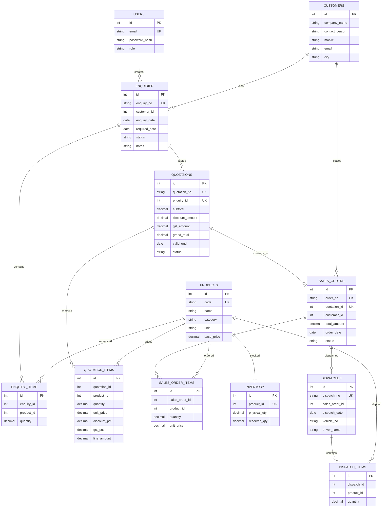

# ER Diagram

```mermaid
erDiagram
    USERS ||--o{ ENQUIRIES : creates
    CUSTOMERS ||--o{ ENQUIRIES : has
    ENQUIRIES ||--o{ ENQUIRY_ITEMS : contains
    PRODUCTS ||--o{ ENQUIRY_ITEMS : requested
    ENQUIRIES ||--o{ QUOTATIONS : quoted
    QUOTATIONS ||--o{ QUOTATION_ITEMS : contains
    PRODUCTS ||--o{ QUOTATION_ITEMS : priced
    QUOTATIONS ||--o| SALES_ORDERS : converts_to
    CUSTOMERS ||--o{ SALES_ORDERS : places
    SALES_ORDERS ||--o{ SALES_ORDER_ITEMS : contains
    PRODUCTS ||--o{ SALES_ORDER_ITEMS : ordered
    PRODUCTS ||--|| INVENTORY : stocked
    SALES_ORDERS ||--o{ DISPATCHES : dispatched
    DISPATCHES ||--o{ DISPATCH_ITEMS : contains
    PRODUCTS ||--o{ DISPATCH_ITEMS : shipped

    USERS { int id PK string email UK string password_hash string role }
    CUSTOMERS { int id PK string company_name string contact_person string mobile string email string city }
    PRODUCTS { int id PK string code UK string name string category string unit decimal base_price }
    INVENTORY { int id PK int product_id UK decimal physical_qty decimal reserved_qty }
    ENQUIRIES { int id PK string enquiry_no UK int customer_id date enquiry_date date required_date string status string notes }
    ENQUIRY_ITEMS { int id PK int enquiry_id int product_id decimal quantity }
    QUOTATIONS { int id PK string quotation_no UK int enquiry_id UK decimal subtotal decimal discount_amount decimal gst_amount decimal grand_total date valid_until string status }
    QUOTATION_ITEMS { int id PK int quotation_id int product_id decimal quantity decimal unit_price decimal discount_pct decimal gst_pct decimal line_amount }
    SALES_ORDERS { int id PK string order_no UK int quotation_id UK int customer_id decimal total_amount date order_date string status }
    SALES_ORDER_ITEMS { int id PK int sales_order_id int product_id decimal quantity decimal unit_price }
    DISPATCHES { int id PK string dispatch_no UK int sales_order_id date dispatch_date string vehicle_no string driver_name }
    DISPATCH_ITEMS { int id PK int dispatch_id int product_id decimal quantity }
```
